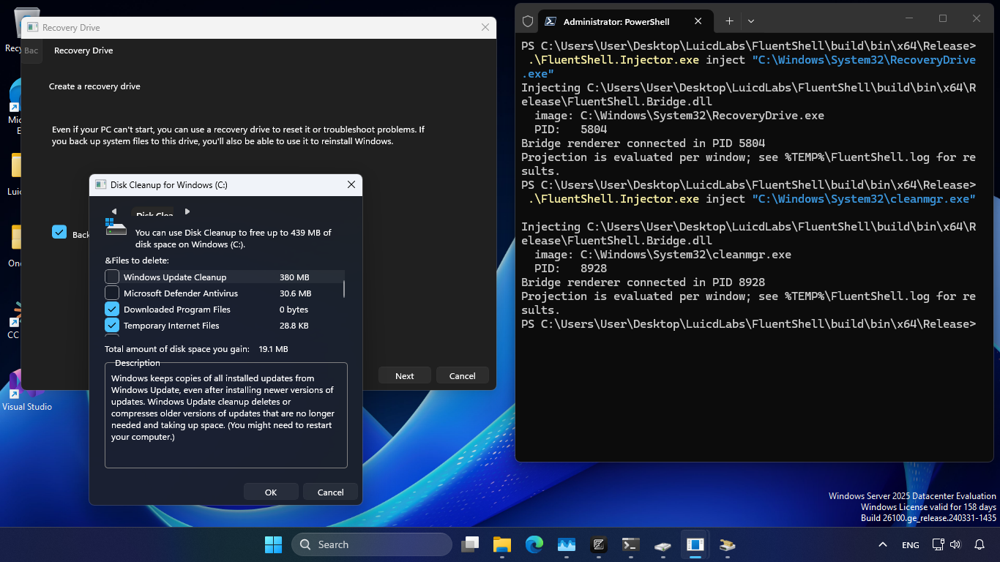

# FluentShell

Turn a running Win32 window into a real WinUI 3 window, without changing the application.

FluentShell captures a live HWND control tree, rebuilds it as genuine XAML in a separate
WinUI 3 process, and keeps the two in sync: input on the projected window is replayed onto
the native controls, and native changes patch back into the view. UI Automation reports real
XAML controls, with framework theming, DPI handling, and accessibility, while the original
HWNDs stay alive and remain the source of truth.

Nothing is recolored or repainted along the way. There are no DWM attribute tricks and nothing
is drawn on top of native controls; the native window is cloaked only once its XAML replacement
has been proven, and the only thing that enters the target process is a small C++ DLL,
`FluentShell.Bridge.dll`. All XAML lives in `Renderer\FluentShell.Renderer.exe`.

The translation is all or nothing. A window projects only when every visible control can be
proven against the adapter registry, and an unsupported control, a protocol fault, or a dead
renderer restores the whole native window instead of leaving a half-XAML surface behind.
Injection stays explicit and per target: you name an absolute image path, and a PID when that
image is running more than once. There is no system-wide hooking and no watch mode.



## Architecture

```text
native Win32 HWND/control tree (canonical state)
        | snapshot / patch                 ^ semantic action / result
        v                                  |
FluentShell.Bridge.dll -- versioned pipe -- FluentShell.Renderer.exe
      target process                         separate WinUI 3 process
```

`FluentShell.Bridge.dll` is the only injected production DLL. It reads and writes native state
exclusively on each HWND's own GUI thread, serves the pipe, and owns rollback.
`Renderer\FluentShell.Renderer.exe` is a self-contained, unpackaged x64 WinUI 3 process that
owns the XAML windows, typed view models, binding, and transient input state. The two sides
meet only through the versioned `FLSH` frame and the JSON schema in
`src/Protocol/protocol-v1.schema.json`, so neither reaches into the other's state directly.

The current control boundary is bounded textual HMENU command bars, standard
Static text and icons, Button/check/three-state/radio/GroupBox, Edit and
password Edit, dropdown-list/editable dropdown ComboBox, ListBox, SysLink,
report-mode SysListView32, textual top-tab SysTabControl32, one-row
ToolbarWindow32, textual status bars, and determinate or marquee horizontal
ProgressBar controls plus supported MessageBox and static TaskDialog shapes.
Owner-draw, custom HWND classes, RichEdit, TreeView, Trackbar, uncontracted
virtual controls, embedded browser/XAML, layered/nonrectangular windows, and
custom non-client rendering remain native. The staged adapter expansion is
documented in
`docs/goals/win32-to-winui-translation/CONTROL-ADAPTER-ROADMAP.md`.

Built-in DirectUI surfaces such as MdSched, RecoveryDrive, and the ClearType
Text Tuner are admitted by a separate profile-driven engine. Two pinned
executables have exact page profiles; every other Microsoft-signed canonical
System32 page is admitted by capability, taking each projected slot's kind from
the same Win32 adapter registry as above and rejecting the whole window on any
role that registry cannot prove. See
`docs/goals/win32-to-winui-translation/DIRECTUI-APPLICATION-ADAPTERS.md`.

## Safety Boundary

The target is an existing absolute executable image path, resolved through a file handle, and
the path read back from the selected process must match that canonical path. `--pid` is
required when several processes share one image, and `--sha256` pins the file itself; signer
pinning is rejected on purpose until it is implemented. Shell, security, and XAML host
processes are hard-denied, along with the FluentShell renderer and FluentShell's own tools.
Process-name injection, system-wide discovery, and injection watch modes do not exist in the
production Injector.

The one-shot `l0` command is the only diagnostic exposed by the production Injector. `IslandDemo` remains a source-level diagnostic and is excluded from the default production build.

## Build And Test

Requirements are Visual Studio with the x64 C++ toolchain, Windows SDK 10.0.26100, and the .NET 8 or newer SDK.

```powershell
.\build.ps1 -Configuration Release
.\test.ps1 -Configuration Release
```

Production output is isolated as follows:

```text
build\bin\x64\Release\
  FluentShell.Injector.exe
  FluentShell.Bridge.dll
  LegacyDialogHost.exe
  Renderer\
    FluentShell.Renderer.exe
    ... WinUI 3, Windows App SDK, and .NET runtime payload ...
```

The build clears this configuration's output directory before compiling, publishes the renderer only under `Renderer`, and fails if Bootstrap or renderer runtime files appear at the production root.

## Run The Translation Oracle

Open PowerShell in the production output directory:

```powershell
$target = (Resolve-Path .\LegacyDialogHost.exe).Path
$process = Start-Process $target -PassThru
.\FluentShell.Injector.exe inject $target --pid $process.Id
```

When there is exactly one matching process, `--pid` may be omitted. To pin the binary:

```powershell
$hash = (Get-FileHash $target -Algorithm SHA256).Hash
.\FluentShell.Injector.exe inject $target --pid $process.Id --sha256 $hash
```

`LegacyDialogHost` exposes Edit, CheckBox, ComboBox, ListBox, GroupBox, a
native-updated ProgressBar and timer value, MessageBox/TaskDialog result
reporting, a close-veto toggle, and a button that creates an unsupported custom
child. The log is `%TEMP%\FluentShell.LegacyDialogHost.log`; Bridge diagnostics
use `%TEMP%\FluentShell.log`.

Expected behavior:

- UI Automation identifies the projected controls as XAML and exposes their normal patterns.
- User edits and selections return to the native controls; native timer text patches the WinUI view.
- Dialog button IDs and verification state return to the native host and appear in its result field/log.
- Selecting close veto rejects a proxy close because the native `WM_CLOSE` handler keeps the HWND alive.
- Creating the custom child or terminating the renderer restores the whole native window without terminating the target.

## Diagnostics

```powershell
.\FluentShell.Injector.exe l0
```

The default solution lists `FluentShell.Island` and `IslandDemo` for manual research but does not build them. When that legacy diagnostic is needed, build `src\PoC\IslandDemo\IslandDemo.vcxproj` explicitly with an `OutDir` outside the production folder and run `IslandDemo.exe` there; it is not an Injector entry point.

Reference source under `ref_src` is read-only. WinUIShell informs the server/IPC/lifetime shape; its reflection RPC layer is not copied. The GPL-licensed modernizer sample is behavioral research only and contributes no copied implementation.
