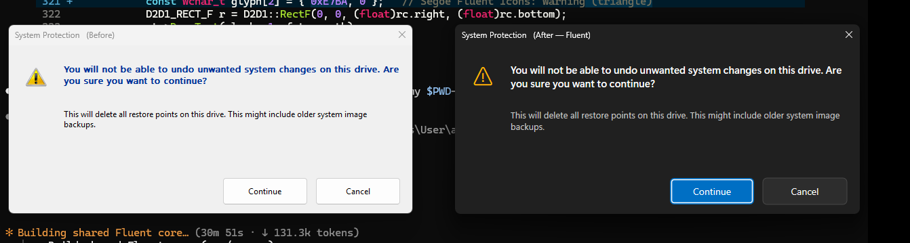

# AnyFluent

把舊版 Win32 對話框（`#32770` / TaskDialog）在**執行期**轉換成現代化的深色 **Fluent Design** UI 的 C++ 引擎與研究專案。不需要原始碼、不修改系統檔案、不碰核心（no `win32k.sys`），全程在使用者態運作且可還原。

這是對 `xaml islands.txt` 與 `dwm method 1.txt` 兩份分析的**驗證與落地**：確認「XAML Islands 全域注入」不可行，改用 **DWM 視覺層屬性 + 使用者態 API Hook/注入 + Direct2D/DirectWrite 控件重繪**，並在本機（Windows 11 25H2 / build 26200、Visual Studio 2026 / MSVC 14.51）實際編譯與測試。

## 成果一覽（before → after）

| Tier | 說明 | 截圖 |
| :--- | :--- | :--- |
| 1 | 自包含 before/after 示範（重現 `Untitled.png`） | `docs/images/tier1_before_after.png` |
| 2 | DLL 注入到獨立黑盒程式（classic 全轉換；TaskDialog 邊框+按鈕） | `docs/images/tier2_classic_injected.png` |
| 3 | 全域 WH_CBT 勾（未直接注入的程式也被轉換） | `docs/images/tier3_global_uninjected.png` |
| 3 | **真實系統程序** `SystemPropertiesProtection.exe` 被注入改造 | `docs/images/tier3_sysprotection.png` |



## 專案結構

```
src/common/FluentCore.{h,cpp}   共用核心：DWM、未公開 uxtheme 深色、Direct2D 重繪、子類化、#32770 調度
src/demo/                       Tier 1：資源對話框 before/after 示範
src/testtarget/                 Tier 2：故意做舊的黑盒測試程式（classic + TaskDialog）
src/hookdll/dllmain.cpp         被注入的轉換 DLL（WinEvent + 子類化；匯出 CbtProc 供全域勾）
src/injector/main.cpp           注入器：--pid / --exe / --global / --watch
src/tools/capture.cpp           GDI+ 截圖工具（測試用）
docs/                           研究報告（多份 .md）+ images/
build.ps1                       載入 VS2026 開發環境並用 MSVC 建置
```

## 建置

```powershell
# 需要 Visual Studio 2026（含 C++ 桌面工作負載）+ Windows 11 SDK
cd C:\Users\User\anyfluent
.\build.ps1 all      # 或 demo / testtarget / hookdll / injector / capture
# 產物：build\bin\*.exe, build\bin\anyfluenthook.dll
```

## 執行 / 測試

```powershell
$bin = "C:\Users\User\anyfluent\build\bin"

# Tier 1：並排 before/after
& "$bin\demo.exe"

# Tier 2：目標式注入
$tt = Start-Process "$bin\testtarget.exe" -PassThru
& "$bin\injector.exe" --pid $tt.Id      # 之後點測試程式的按鈕

# Tier 3：全域勾（任何 #32770 都會被現代化；系統程序需以系統管理員執行）
& "$bin\injector.exe" --global          # Ctrl+C 解除
```

> ⚠️ **安全**：真實 System Protection 的「刪除還原點」確認框是**破壞性**的。測試時只看樣式、一律按 **Cancel**，絕不按 Continue。本專案不做持久化、不做防毒規避。

## 研究報告（`docs/`）

- [00 — 執行摘要](docs/00-executive-summary.md)
- [01 — 為什麼 XAML Islands 全域注入行不通](docs/01-why-xaml-islands-fails.md)
- [02 — DWM 視覺層現代化](docs/02-dwm-visual-layer.md)
- [03 — 注入與 Hook 機制](docs/03-injection-and-hooking.md)
- [04 — Direct2D/DirectWrite 控件重繪](docs/04-control-repaint-direct2d.md)
- [05 — 實作與本機測試結果](docs/05-implementation-and-test-results.md)
- [06 — 風險、限制與路線圖](docs/06-risks-limitations-roadmap.md)
- [參考來源](docs/references.md)
