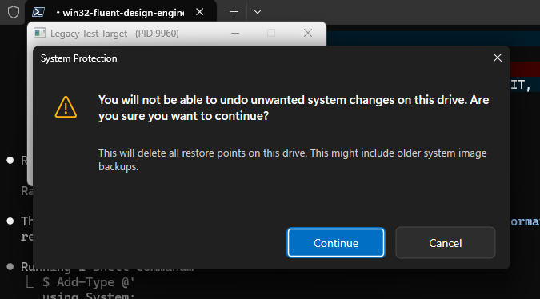
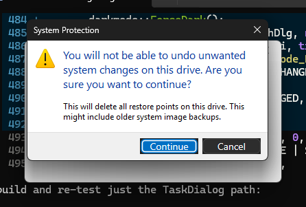
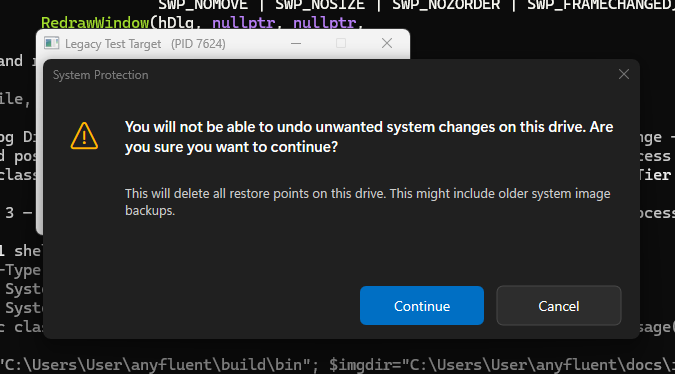
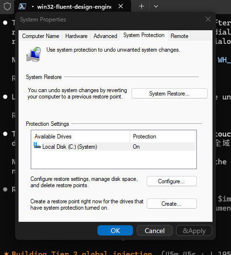

# 05 — 實作與本機測試結果

全部在本機實際編譯、執行、截圖。環境：Windows 11 25H2（build **26200.8457**）、Visual Studio Community **2026**（MSVC **14.51.36231**）、Windows SDK **10.0.26100**。

## 產物

| 檔案 | 說明 |
| :--- | :--- |
| `demo.exe` | Tier 1 自包含 before/after |
| `testtarget.exe` | Tier 2 黑盒測試程式（classic + TaskDialog） |
| `anyfluenthook.dll` | 被注入的轉換 DLL（WinEvent + 子類化；匯出 `CbtProc`） |
| `injector.exe` | 注入器（`--pid`/`--exe`/`--global`/`--watch`） |
| `capture.exe` | GDI+ 截圖工具（測試用） |

## 建置

`cl` 不在 PATH，`build.ps1` 先載入 VS 開發環境再編譯：

```powershell
Import-Module "$vs\Common7\Tools\Microsoft.VisualStudio.DevShell.dll"
Enter-VsDevShell -VsInstallPath "$vs" -SkipAutomaticLocation -DevCmdArguments "-arch=amd64 -host_arch=amd64"
cl /nologo /EHsc /std:c++17 /utf-8 <sources> /link user32.lib gdi32.lib dwmapi.lib d2d1.lib dwrite.lib uxtheme.lib comctl32.lib gdiplus.lib shcore.lib
```

工具鏈煙霧測試確認：`D2D1CreateFactory`、`DWriteCreateFactory`、三個現代 DWM 屬性、`uxtheme` 序號 135/133 全部回傳成功/有效指標。

---

## Tier 1 — 自包含 before/after

`demo.exe` 用同一份資源對話框建兩個 `#32770`，右邊跑 `fluent::ModernizeDialog`。精準重現 `Untitled.png`。


- **Before**：亮色、藍色粗體主指示、黃色三角形、3D 按鈕。
- **After**：深色底、深色標題列、圓角、Segoe Fluent 警告三角形（`U+E7BA`）、Segoe UI Variable 文字、Accent 藍主按鈕「Continue」（含焦點環）、深色邊框「Cancel」。

---

## Tier 2 — 目標式 DLL 注入到黑盒程式

`injector.exe --pid <testtarget>`（`CreateRemoteThread + LoadLibraryW`）→ 注入後觸發對話框。`testtarget.exe` **完全沒有 AnyFluent 程式碼**。

### classic `#32770`：完整轉換 ✅



與 Tier 1 的 After 同級——證明**無原始碼黑盒改造**成立。注入回報 `LoadLibraryW -> 有效 HMODULE (loaded)`。

### TaskDialog：邊框 + 真實按鈕轉換，DirectUI 內文為限制



深色標題列 + 圓角 + 兩顆真實 `Button`（Accent「Continue」/ 深色「Cancel」）已 Fluent 化；但 `DirectUIHWND` 內的圖示與文字維持亮色（見 [04](04-control-repaint-direct2d.md) 的技術原因）。這正是研究預測的 classic vs TaskDialog 差異的實證。

---

## Tier 3 — 全域勾 / 真實系統程序

### 全域勾修改「未直接注入」的程式 ✅

`injector.exe --global`（`SetWindowsHookEx(WH_CBT, …, 0)`）啟動後，另起一個**未被直接注入**的全新 `testtarget.exe`，其 `#32770` 仍被自動完整轉換：



證明「全域」機制：裝一個勾，桌面上任何冒出的 `#32770` 都自動現代化。

### 真實系統程序 `SystemPropertiesProtection.exe` ✅

全域勾運行下，開啟**真實**的 System Protection 設定（就是圖片來源的系統元件），其按鈕被**注入的 Direct2D**重繪：



「System Restore…」「Configure…」「Create…」與底部 Accent「OK」/ 深色「Cancel」「Apply」皆為本引擎渲染——這是一個**未修改的 Windows 系統進程**，UI 在執行期被改變，且**非破壞性**（沒點任何東西、沒動任何還原點）。

**限制**：這種多頁 property sheet（分頁、群組框、清單、巢狀頁面對話框）只會**部分**轉換（背景/分頁仍亮色），因為它由巢狀頁面對話框與自繪背景組成，且我們在其「已顯示之後」才注入（DWM 深色標題對已顯示視窗刷新不完全）。**簡單的確認 `#32770`（就是圖片目標那種）則完整轉換**（如 Tier 1/2 classic）。

---

## 安全與清理驗證

- 測試後檢查：`injector`/`testtarget`/`demo`/`SystemPropertiesProtection` **無殘留進程**；殺掉 injector 即移除全域勾。
- **還原點完好**：測試全程未觸發任何刪除；`Get-ComputerRestorePoint` 確認既有還原點（序號 3）仍在。
- 破壞性的「刪除還原點」確認框：測試準則為只看樣式、一律 Cancel（本輪未觸發它，改以非破壞性的 System Protection 設定視窗驗證真實系統可達性）。

## 可複現指令

見 [README](../README.md) 的「執行 / 測試」。截圖由 `capture.exe pid <PID> <out.png>` 產生（GDI `BitBlt` + GDI+ PNG，可含 DWM 合成的圓角/陰影）。
